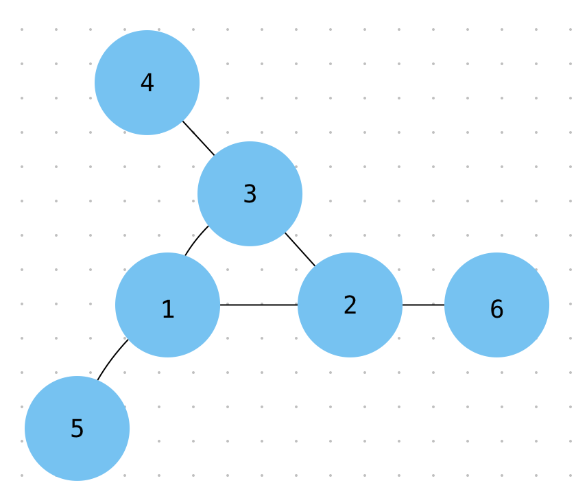

# Project Euler 068 - Magic 5-Gon Ring

Consider the following &quot;magic&quot; 3-gon ring, filled with the numbers 1 to 6, and each line adding to nine.

Working clockwise, and starting from the group of three with the numerically lowest external mode (4, 3, 2 in this example), each solution can be described uniquely.  For example, the above solution can be described by the set: 4,3,2; 6,2,1; 5,1,3.

It is possible to complete the ring with four different totals: 9, 10, 11 and 12.  There are eight solutions in total.

Total 9  - Solution Set 4,2,3; 5,3,1; 6,1,2; 4,3,2; 6,2,1; 5,1,3

Total 10 - Solution Set 2,3,5; 4,5,1; 6,1,3; 2,5,3; 6,3,1; 4,1,5

Total 11 - Solution Set 1,4,6; 3,6,2; 5,2,4; 1,6,4; 5,4,2; 3,2,6

Total 12 - Solution Set 1,5,6; 2,6,4; 3,4,5; 1,6,5; 3,5,4; 2,4,6

By concatenating each group, it is possible to form 9-digit strings, the maximum string for a 3-gon ring is 432621513.

Using the numbers 1 to 10, and depending on arrangements, it is possible to form 16- and 17-digit strings.  What is the maximum 16-digit string for a &quot;magic&quot; 5-gon ring?

Information at [Project Euler 068](https://projecteuler.net/problem=68)

## UX

**Getting Started**

Select the Show Solution button to show the solution.  Select the Hide Solution button to hide the solution.

**User Stories**

As a user, I can show or hide the solution by selecting the appropriate button.

As a user, I expect the function `magic5GonRing()` to return a number.

As a user, I expect the function `magic5GonRing()` to return 6531031914842725.

User Stories on function `magic5GonRing()` taken from [FreeCodeCamp - Coding Interview Prep - Project Euler 068](https://www.freecodecamp.org/learn/coding-interview-prep/project-euler/problem-68-magic-5-gon-ring)

**Information Architecture**

The function `magic5GonRing()` returns a number.

## Features

Allows the user to show or hide the solution to the problem as described in [Project Euler 068](https://projecteuler.net/problem=68).

## Technologies

Uses HTML5, CSS3, JavaScript, Bootstrap 5.2.3 and Google Fonts.

## Testing

Ensure all user stories have been met.

## Deployment

Deployed on [GitHub Pages](https://derektypist.github.io/project-euler-068) at the main branch.

## Credits

### Content

Written by me.

### Media

[Image](image/ring.png) created on Freeform.  A screenshot has been taken while using Freeform.

### Acknowledgements

- [Project Euler](https://projecteuler.net)
- [GitHub](https://www.github.com)
- [FreeCodeCamp](https://www.freecodecamp.org)
